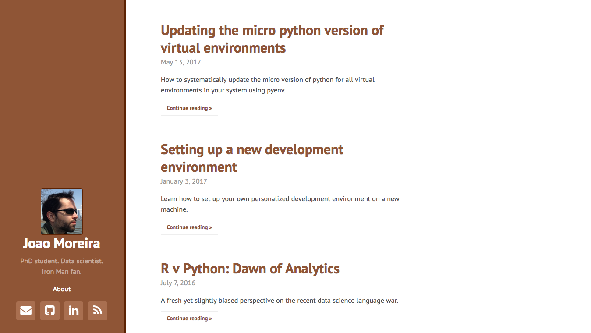

# pelican-hyde

**NOTE: This is a fork of the original pelican-hyde theme altered for my personal website.**

The pelican-hyde is a [Pelican](https://github.com/getpelican) theme inspired on the beautiful [Hyde](http://hyde.getpoole.com/) Jekyll theme.

You can see a live demo [here](http://jagmoreira.github.io/)




If you're using Pelican 3.7 or older and are using feeds then make sure to use `{slug}` instead of `%s` in your feed variables. For example:

    CATEGORY_FEED_ATOM = 'feeds/{slug}.atom.xml'

See [here](https://docs.getpelican.com/en/stable/changelog.html#id6) for more information.

## Requirements

This template automatically concatenates and minifies all css files.

1. Install the `webassets` and `cssmin` packages:

        pip install webassets cssmin

1. Install the [assets](https://github.com/getpelican/pelican-plugins/tree/master/assets) pelican plugin.

1. Activate the plugin:

```python
PLUGIN_PATHS = ['pelican-plugins']      # Or wherever you installed the plugin
PLUGINS = ['assets']
```

### GitHub Pages

GitHub pages currently (2017-05-24) only caches resources for 10 mins. So if you are hosting your website on GitHub you may want to disable the caching behavior of `webassets` to simplify the minified css:

```python
# Disable caching and versioning of static resources since GitHub pages
# caches stuff for only 10 mins
ASSET_CONFIG = (
    ('url_expire', False),
    ('manifest', False),
    ('cache', False),
)
```
